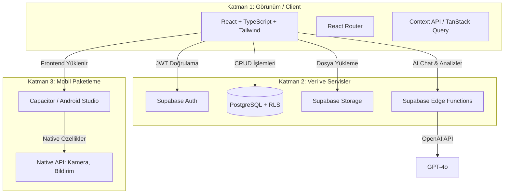
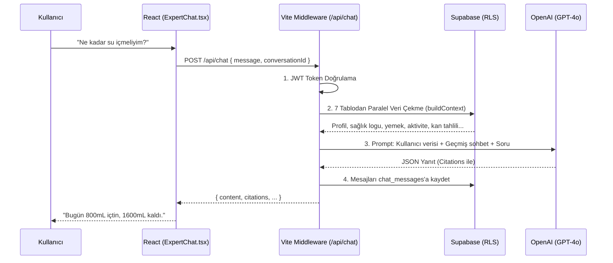
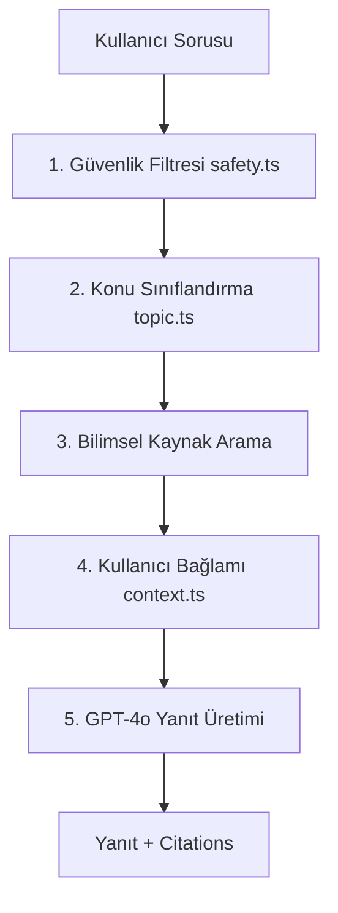

# Myora — Sıfırdan Master Seviyeye Proje Öğrenme Rehberi

> **Yaklaşım:** Her konuda önce **ne olduğunu ve neden var olduğunu** açıklıyoruz, sonra **dosyaya link** veriyoruz. Öğrenmeyi aktif hale getirmek için her bölüme **[ ] Okundu** kutucukları ve **🛠️ Pratik Görevler** eklenmiştir.
> **Son Güncelleme:** 5 Nisan 2026

---

## Nasıl Kullanılır?

Her bölüm şu kalıbı izler:

```markdown
- [ ] 1. NE?    → Bu dosya/kavram ne işe yarıyor?
- [ ] 2. NEDEN? → Bu şekilde yapılmasının mimari gerekçesi ne?
- [ ] 3. DESEN  → Hangi yazılım tasarım desenini (pattern) kullanıyor?
- [ ] 4. LİNK   → DOSYAYA LİNK (tıkla, dosyaya git)
- [ ] 5. GÖREV  → 🛠️ Kodu okuduktan sonra yapacağın küçük deneme
```

Dosyalara gitmeden önce **en az İçindekiler ve Bölüm 1'i** oku — genel haritayı anlamadan detaylara dalmak kafa karıştırır. İşaretleyerek ilerle!

---

## İçindekiler

1. [Projenin Mimarisini Anla — Büyük Resim](#bölüm-1-büyük-resim-mimari)
2. [Yazılım Tasarım Desenleri — Bu Projede Kullanılanlar](#bölüm-2-yazılım-tasarım-desenleri)
3. [Giriş Noktaları — Uygulama Nasıl Başlar?](#bölüm-3-giriş-noktaları)
   - 3.1 main.tsx — React'i Başlatan Dosya
   - 3.2 App.tsx — Router ve Global Provider'lar
   - 3.3 Router Seçimi — HashRouter vs BrowserRouter
   - 3.4 AppLayout.tsx — Ana Çerçeve
   - 3.5 NotFound.tsx — 404 Sayfası
4. [Güvenlik ve Auth Sistemi](#bölüm-4-güvenlik-ve-auth-sistemi)
5. [Veri Katmanı — Veritabanı ve API](#bölüm-5-veri-katmanı)
6. [UI Bileşenleri — Ekranların Anatomisi](#bölüm-6-ui-bileşenleri)
7. [Paylaşılan Veri — Context Sistemi](#bölüm-7-paylaşılan-veri-context-sistemi)
8. [Dil ve Tema Sistemi](#bölüm-8-dil-ve-tema-sistemi)
9. [Yapay Zeka Katmanı — AI Chat Middleware + Edge Functions](#bölüm-9-yapay-zeka-katmanı)
10. [Mobil Uygulama Katmanı — Capacitor](#bölüm-10-mobil-uygulama-katmanı)
11. [Çapraz Kesim — Loglama, Validasyon, Performans](#bölüm-11-çapraz-kesim-konular)
12. [Uçtan Uca Özellik İzleme — Master Egzersizi](#bölüm-12-master-egzersizi)
13. [Sözlük](#sözlük)

---

## Bölüm 1: Büyük Resim — Mimari

Koda bakmadan önce projenin genel haritasını zihninde oluşturman gerekiyor.

### 1.1 Üç Katmanlı Mimari

Myora "Frontend-only + BaaS" mimarisini kullanır. Geleneksel mimariden farkı şu:

```
GELENEKSEl:  Tarayıcı → Backend Sunucu → Veritabanı
MYORA:       Tarayıcı → Supabase SDK  → PostgreSQL + Edge Functions
CHAT:        Tarayıcı → /api/chat (Vite Middleware) → Supabase + GPT-4o
```

Bunu somutlaştıralım:

Bunu somutlaştıralım:



### 1.2 Monorepo Yapısı

**NE?** Tek bir Git deposunda (repo) hem frontend hem paylaşılan şema hem backend fonksiyonları var.

**NEDEN?** `shared/schema.ts` dosyası hem veritabanı tanımını hem TypeScript tiplerini içerir. Frontend bu tipleri doğrudan kullanır — iki ayrı repo olsaydı senkronizasyon sorunu çıkardı.

```
wellness-vision-coach/           ← Proje kökü
│
├── client/                      ← Frontend (tarayıcıda çalışır)
│   └── src/
│       ├── App.tsx              ← Router + global provider'lar
│       ├── pages/               ← Her URL bir sayfa
│       ├── components/          ← Ekran parçaları
│       ├── contexts/            ← Paylaşılan veri depoları
│       ├── hooks/               ← Özel React hook'ları
│       └── lib/                 ← Yardımcı araçlar (api, supabase, logger...)
│
├── shared/                      ← Frontend + backend paylaşır
│   └── schema.ts                ← Veritabanı tablo tanımları + TypeScript tipleri
│
├── server/                      ← Aktif sunucu kodu
│   └── chatHandler.ts           ← ★ AI Chat Vite middleware (/api/chat)
│
├── supabase/                    ← Backend (Supabase sunucusunda çalışır)
│   ├── functions/               ← 3 AI Edge Function
│   └── migrations/              ← Veritabanı oluşturma SQL dosyaları
│
├── vite.config.ts               ← Build, dev server + chatApiPlugin() middleware
└── capacitor.config.ts          ← Mobil paketleme ayarları
```

**→ [Proje yapılandırması: vite.config.ts](../vite.config.ts)**

**Okurken bak:**
- `root: path.resolve(projectRoot, "client")` → Build noktası `client/` klasörü
- `server.host: "0.0.0.0"`, `server.port: 5000` → Dev server ayarları
- `server.allowedHosts: true` → Proxy/tunnel uyumluluğu
- `chatApiPlugin()` → `/api/chat` endpoint'ini Vite middleware olarak kaydeder (Bölüm 9.0'da açıklanıyor)
- `manualChunks()` → Vendor chunk splitting: React, Supabase, Radix UI, Capacitor vb. ayrı chunk'lara bölünür (Bölüm 11'de açıklanıyor)
- `removeCrossorigin()` plugin'i → Capacitor Android WebView uyumluluğu için `crossorigin` attribute'unu HTML'den kaldırır

---

**→ [Mobil yapılandırma: capacitor.config.ts](../capacitor.config.ts)**

**Okurken bak:**
- `appId: "com.myora.app"` → App Store / Play Store'da bu ID ile yayınlanır
- `webDir: "dist/public"` → Build çıktısı buraya gider, Capacitor oradan alır
- `SplashScreen`, `Keyboard`, `LocalNotifications` plugin ayarları → Mobil davranışların yapılandırması

---

**→ [Proje bağımlılıkları: package.json](../package.json)**

**Okurken bak:**
- `"dev": "vite --port 5000 --host 0.0.0.0"` → Geliştirme komutu
- `dependencies` bölümü → Üretim kütüphaneleri
- `devDependencies` → Sadece geliştirme sırasında kullanılanlar
- `@capacitor/*` paketleri → Mobil native API erişimi

---

## Bölüm 2: Yazılım Tasarım Desenleri

Bu projedeki kalıpları tanıman, her dosyayı görünce "aaa, bu o desen" demen için gerekli.

### 2.1 Component Pattern (Bileşen Deseni)

**NE?** UI'yı küçük, bağımsız, tekrar kullanılabilir parçalara bölme yaklaşımı.

**NEDEN?** `WaterWidget` hem dashboard'da hem farklı bir sayfada kullanılabilir. Bir yerde düzeltirsek her yerde düzelir.

```
Sayfa (Page)
  └── Bileşen A (Component)
        └── Alt Bileşen B
              └── UI Bileşeni (Button, Card...)
```

### 2.2 Context + Provider Pattern

**NE?** Veriyi prop drilling yapmadan (bileşenden bileşene aktarmadan) tüm uygulamada paylaşma.

**NEDEN?** `AuthContext` kullanıcı bilgisini tutar. Her bileşene prop olarak geçmek yerine `useAuth()` hook'u çağrılınca doğrudan erişilir.

```
<AuthProvider>               ← Veriyi sağlar
  <LanguageProvider>
    <App>
      <HerhangibirBileşen>   ← useAuth() ile erişir, prop gerekmez
```

### 2.3 Custom Hook Pattern

**NE?** Karmaşık mantığı bileşenden ayırıp hook'a taşıma.

**NEDEN?** `useHealthData` hook'u veri çekme + önbellekleme + güncelleme mantığını içerir. Bunu 10 farklı bileşen kullanabilir — kod tekrarı yok.

### 2.4 Factory Function Pattern

**NE?** Aynı şeyin farklı konfigürasyonlarla üretilmesi.

**NEDEN?** `createSignInSchema(messages)` — Türkçe ve İngilizce hata mesajlarıyla aynı form doğrulama kurallarını üretir. İki ayrı şema yazmak yerine tek fabrika fonksiyonu.

### 2.5 Repository/API Client Pattern

**NE?** Tüm veritabanı iletişimini tek bir yerde toplamak.

**NEDEN?** `lib/api.ts` tüm Supabase çağrılarını içerir. Supabase'den başka bir hizmente geçilse sadece bu dosya değişir, bileşenler hiç değişmez.

### 2.6 Defense in Depth (Derinlemesine Savunma)

**NE?** Güvenlik tek katmanda değil, her katmanda uygulanır.

**NEDEN?** Uygulama kodunda bir hata olsa bile veritabanı RLS'i başka kullanıcının verisini döndürmez. Uygulama + Auth + Edge Function + Veritabanı = 4 bağımsız güvenlik katmanı.

---

## Bölüm 3: Giriş Noktaları

Uygulama başladığında ne olur? Bu zinciri takip et.

### 3.1 `main.tsx` — React'i Başlatan Dosya

**NE?** HTML'deki `<div id="root">` elemanına React uygulamasını bağlayan tek satırlık dosya.

**NEDEN VAR?** Her React uygulamasının bir "çekirdek bağlama" noktası gerekir. Bu dosya sadece bunu yapar — başka hiçbir şey.

**Desen:** Entry Point — Başlangıç noktası, karmaşıklık taşımaz.

**→ [Dosyayı aç: client/src/main.tsx](../client/src/main.tsx)**

**Okurken bak:**
- [ ] `ReactDOM.createRoot(document.getElementById('root'))` → HTML'deki div'i bulup React'i oraya bağlar
- [ ] `<App />` → Her şey buradan dallanan ağaç
- [ ] `<ThemeProvider>` → Tema (Light/Dark/OLED Black) yönetimi
- [ ] `<ErrorBoundary>` → Üst seviye hata yakalayıcı (Class Component)
- [ ] `@fontsource/inter` → Inter font ailesi import edilir (300-700 kalınlıklar)

- [ ] **🛠️ GÖREV:** `main.tsx`'i aç. Oradaki `<ThemeProvider>` içindeki `defaultTheme="light"` ayarını `"dark"` yapıp kaydet. Tarayıcıda ne değiştiğine bak (temayı karanlık yapacak). Sonra geri al.

---

### 3.2 `App.tsx` — Router ve Global Provider'lar

**NE?** Uygulamanın çatısı. Üç ana görevi var: (1) Context provider'ları sarmak, (2) URL'e göre doğru sayfayı göstermek, (3) Splash ekranı ve platform tespiti.

**NEDEN VAR?** Tüm sayfaların erişmesi gereken `AuthContext`, `LanguageContext` gibi provider'lar en üstte sarmalanmalı. Router da en üstte olmalı ki alt bileşenler `useNavigate` gibi hook'ları kullanabilsin.

**Desen:** Provider Composition Pattern + Route-based Code Splitting + Platform Detection

**Önemli Tasarım Kararları:** 
1. **Lazy Loading**: 20+ sayfa bileşeni `React.lazy()` ile yükleniyor. Kullanıcı bir sayfayı ziyaret etmeden o sayfanın kodu indirilmiyor. Bu ilk yükleme boyutunu ~%60 azaltıyor.
2. **Router Seçimi**: Native platformlarda (Capacitor) `HashRouter`, web'de `BrowserRouter` kullanılır.
3. **Splash Screen**: Uygulama açılırken animasyonlu splash ekranı gösterilir, auth yükleme tamamlanınca kaybolur.

```typescript
// App.tsx'deki lazy loading kalıbı
const HealthDashboard = lazy(() => import("@/components/HealthDashboard").then(m => ({ default: m.HealthDashboard })));
const ExpertChat      = lazy(() => import("@/components/ExpertChat").then(m => ({ default: m.ExpertChat })));
// Kullanıcı /chat'e gitmeden ExpertChat kodu indirilmez
```

**→ [Dosyayı aç: client/src/App.tsx](../client/src/App.tsx)**

**Okurken bak:**
- [ ] Üstteki `lazy(() => import(...).then(m => ({ default: m.Component })))` satırları → 20+ bileşen bu şekilde tanımlı
- [ ] `const Router = isNativeWebView ? HashRouter : BrowserRouter` → Platform bazlı router seçimi
- [ ] `<QueryClientProvider>` → TanStack Query önbellek sistemi (30s stale time, retry:1)
- [ ] `<AuthProvider>`, `<LanguageProvider>` → Global state sarmaları
- [ ] `<SplashScreen>` → Uygulama açılışında logo animasyonu (min 800ms, max 2300ms)
- [ ] `<OfflineBanner />` → İnternet bağlantısı kesilince uyarı
- [ ] Nested route yapısı: `/` → `<AppLayout>` → alt sayfalar (dashboard, chat, analytics...)

- [ ] **🛠️ GÖREV:** `App.tsx`'te `<Route path="/debug_test" element={<div>Test Sayfası</div>} />` diye yeni bir geçici rota ekle. Uygulamada o URL'e gidip çalıştığını gör.

---

### 3.3 Router Seçimi — HashRouter vs BrowserRouter

**NE?** Capacitor native platformlarda `HashRouter`, web'de `BrowserRouter` kullanılır.

**NEDEN VAR?** Capacitor `file://` protokolü kullanır, bu durumda normal path-based routing çalışmaz. Hash-based routing (`/#/dashboard`) bu sorunu çözer.

**Desen:** Platform Abstraction + Conditional Routing

```typescript
const isNativeWebView =
  Capacitor.isNativePlatform() ||
  window.location.protocol === 'capacitor:' ||
  window.location.protocol === 'file:';
const Router = isNativeWebView ? HashRouter : BrowserRouter;
```

---

### 3.4 `pages/AppLayout.tsx` — Ana Çerçeve

**NE?** Giriş yapılmış kullanıcının gördüğü ana çerçeve. Alt navigasyon çubuğunu ve içerik alanını içerir.

**NEDEN VAR?** Her içerik sayfasının (Dashboard, Chat, Analytics...) aynı alt menüyü kullanması gerekiyor. Bu ortak çerçeveyi tek bir yerde tutmak tekrar kodu önler.

**Desen:** Layout Component Pattern — Ortak çerçeve ayrı tutulur, içerik değişken.

**→ [Dosyayı aç: client/src/pages/AppLayout.tsx](../client/src/pages/AppLayout.tsx)**

**Okurken bak:**
- `<Outlet />` → İçerik alanı — aktif route'un bileşeni buraya render edilir
- `<BottomNavigation />` → Alt menü bileşeni
- `useAuth()` kullanımı → Layout da kullanıcı bilgisine erişir

---

### 3.5 `pages/NotFound.tsx` — 404 Sayfası

**NE?** Var olmayan URL'ye gidildiğinde gösterilen sayfa.

**NEDEN VAR?** Kullanıcı yanlış URL girerse veya silinen bir bağlantıya tıklarsa boş sayfa yerine anlamlı bir mesaj görmeli.

**Tasarım Detayı:** `logger.warn` ile 404 olayını konsola kaydeder — hangi URL'lerin hata verdiği izlenebilir.

**→ [Dosyayı aç: client/src/pages/NotFound.tsx](../client/src/pages/NotFound.tsx)**

**Okurken bak:**
- `useLocation()` → Kullanıcının gittiği hatalı URL'i alır
- `logger.warn("404 — non-existent route:", location.pathname)` → İzleme kaydı
- `{t.pageNotFound}` → Dil sisteminden çeviri çeker (Bölüm 8)
- `<Link to={ROUTES.HOME}>` → Magic string değil, merkezi route sabiti

---

## Bölüm 4: Güvenlik ve Auth Sistemi

Güvenlik anlayışı olmazsa projenin kritik kısmını atlarsın. Önce genel tabloyu gör.

```
┌───────────────────────────────────────────────────────┐
│ KATMAN 1: Form Validasyonu (Zod)                      │
│   Kötü formatlı veri sunucuya ulaşmadan engellenir    │
├───────────────────────────────────────────────────────┤
│ KATMAN 2: Route Koruması (ProtectedRoute)             │
│   Giriş yapmadan korunan sayfaya erişilemez           │
├───────────────────────────────────────────────────────┤
│ KATMAN 3: Supabase Auth (JWT)                         │
│   Her API isteğinde token doğrulanır                  │
├───────────────────────────────────────────────────────┤
│ KATMAN 4: Veritabanı RLS                              │
│   Her SELECT/INSERT/UPDATE'te "bu veri sana mı ait?"  │
└───────────────────────────────────────────────────────┘
```

### 4.1 `lib/supabase.ts` — Supabase Bağlantısı

**NE?** Supabase istemcisini oluşturan ve yapılandıran dosya. Tüm uygulamada tek bir Supabase örneği vardır.

**NEDEN VAR?** Singleton pattern — her dosya kendi bağlantısını açsaydı yüzlerce gereksiz bağlantı olurdu. Tek bağlantı tüm uygulamada paylaşılır.

**Kritik Tasarım Kararı:** Mobil (Native) platformlarda `localStorage` güvenilir değil. Bu dosya, native platformda `Capacitor Preferences` (SharedPreferences/NSUserDefaults) kullanmak için özel bir depolama adaptörü tanımlar.

**Desen:** Singleton Pattern + Adapter Pattern (depolama adaptörü)

**→ [Dosyayı aç: client/src/lib/supabase.ts](../client/src/lib/supabase.ts)**

**Okurken bak:**
- `if (!supabaseUrl || !supabaseAnonKey) throw new Error(...)` → Eksik config varsa anında çöker — sessiz hata yok
- `const capacitorStorage = { getItem, setItem, removeItem }` → Capacitor Preferences adaptörü
- `isNative = Capacitor.isNativePlatform()` → Web mi, telefon mu? Koşullu davranış
- `storage: capacitorStorage` → Native'de güvenli depolama seçilir

---

### 4.2 `lib/validations/auth.ts` — Form Doğrulama Kuralları

**NE?** Kullanıcının girdiği e-posta ve şifrenin kurallara uyup uymadığını kontrol eden Zod şemaları.

**NEDEN VAR?** Sunucuya kötü veri göndermeden önce istemcide engelle. Hem UX (anında hata mesajı) hem performans (gereksiz network isteği yok) için.

**Kritik Tasarım Kararı:** `createSignInSchema(messages)` bir factory fonksiyonu. Normal şema olsaydı hata mesajları hardcoded Türkçe olurdu. Factory sayesinde aynı kuralları Türkçe veya İngilizce mesajlarla kullanabiliyoruz.

**Desen:** Factory Function Pattern + Schema Validation

```typescript
// Fabrika fonksiyon kalıbı
export const createSignInSchema = (m = defaultAuthMessages) =>
  z.object({
    email:    z.string().min(1, m.emailRequired).email(m.emailInvalid),
    password: z.string().min(1, m.passwordRequired).min(6, m.passwordMinLength),
  });

// Kullanım:
const trSchema = createSignInSchema();                    // Türkçe mesajlar
const enSchema = createSignInSchema({ emailRequired: "Email is required" }); // İngilizce
```

**→ [Dosyayı aç: client/src/lib/validations/auth.ts](../client/src/lib/validations/auth.ts)**

**Okurken bak:**
- `defaultAuthMessages` → Varsayılan Türkçe mesajlar
- `createSignInSchema` → Giriş şeması fabrikası
- `createSignUpSchema` → Kayıt şeması — ek kurallar (şifre karmaşıklığı, ad uzunluğu)
- `.regex(/[A-Za-z]/, ...)` → En az bir harf zorunluluğu
- Fonksiyon imzası: `(m = defaultAuthMessages)` → Parametre verilmezse Türkçe kullan

---

### 4.3 `contexts/AuthContext.tsx` — Kim Giriş Yapmış?

**NE?** Tüm uygulamada "kim giriş yapmış?" sorusunu yöneten merkezi durum deposu. `signIn`, `signUp`, `signOut` fonksiyonları ve `user` bilgisi buradan gelir.

**NEDEN VAR?** Kullanıcı bilgisi onlarca bileşende kullanılır. Context olmadan her bileşene prop olarak geçmek gerekir — bu "prop drilling" antipattern'idir.

**Kritik Tasarım Kararı:** Auth durumu değiştiğinde (`onAuthStateChange`) Context otomatik güncellenir ve tüm uygulamayı yeniden render eder. Sayfa yenilemeden kullanıcı durumu senkron kalır.

**Desen:** Context + Provider Pattern + Observer Pattern (auth state dinleme)

```typescript
// Herhangi bir bileşende kullanımı
const { user, signOut, loading } = useAuth();

if (loading)   return <Spinner />;           // Henüz kontrol ediliyor
if (!user)     return <div>Giriş gerekli</div>; // Giriş yapılmamış
return <div>Hoşgeldin, {user.displayName}!</div>; // Giriş yapılmış
```

**→ [Dosyayı aç: client/src/contexts/AuthContext.tsx](../client/src/contexts/AuthContext.tsx)**

**Okurken bak:**
- `interface User { ... }` → TypeScript'te kullanıcı veri modeli
- `interface AuthContextType { ... }` → Context'in sunduğu tüm değer ve fonksiyonlar
- `supabase.auth.onAuthStateChange(...)` → Supabase oturum değişikliğini dinler
- `signIn` fonksiyonu → `supabase.auth.signInWithPassword` çağrısı
- `signUp` fonksiyonu → Hesap oluşturma + profil tablosuna kayıt
- `fetchUserProfile` → Supabase'den ek kullanıcı bilgilerini çeker
- `export const useAuth = () => useContext(AuthContext)` → Kısa kullanım hook'u

---

### 4.4 `components/ProtectedRoute.tsx` — Sayfa Erişim Koruması

**NE?** Giriş yapmamış kullanıcının korunan sayfalara erişimini engelleyen bileşen.

**NEDEN VAR?** Her sayfaya ayrı ayrı `if (!user) redirect()` yazmak yerine router seviyesinde tek bir kural.

**Desen:** Higher-Order Component (HOC) variation — Bir bileşeni sararak ek davranış ekler.

**→ [Dosyayı aç: client/src/components/ProtectedRoute.tsx](../client/src/components/ProtectedRoute.tsx)**

**Okurken bak:**
- [ ] `const { user, loading } = useAuth()` → AuthContext'ten kullanıcı bilgisi
- [ ] `if (loading) return <...>` → Auth kontrol edilirken boş sayfa değil, loading göster
- [ ] `if (!user) return <Navigate to="/auth" replace />` → Yetkisiz → Auth sayfasına yönlendirme

- [ ] **🛠️ GÖREV:** `if (!user)` kontrolünün içindeki `Navigate to="/auth"` kısmını geçici olarak `to="/not-found"` yap. Çıkış yap ve ana sayfaya girmeyi dene. Nereye yönlendirildiğini gör, sonra eski haline çevir.

---

## Bölüm 5: Veri Katmanı

Verinin nasıl depolandığını ve nasıl çekildiğini anlamak için şu zinciri bil:

```
Bileşen → Hook → api.ts → Supabase SDK → PostgreSQL
```

### 5.1 `shared/schema.ts` — Veritabanı Haritası

**NE?** Tüm veritabanı tablolarının yapı tanımı. Drizzle ORM formatında yazılmış, hem TypeScript tiplerini hem SQL şemasını üretir.

**NEDEN VAR?** Tek kaynak (single source of truth) prensibi. Tablo yapısı burada tanımlanır, hem frontend TypeScript tipleri hem veritabanı şeması buradan türetilir.

**Kritik Tasarım Kararı:** `shared/` klasöründe — hem frontend hem backend kullanır. Multi-repo'da bu iki repo arasında senkronizasyon sorunu olurdu.

**Desen:** Schema-as-Code + Single Source of Truth

```typescript
// Tablo tanımı kalıbı
export const users = pgTable("users", {
  id:       serial("id").primaryKey(),           // Otomatik artan ID
  email:    text("email").notNull().unique(),    // Boş olamaz, tekil
  language: text("language").default("tr"),      // Varsayılan değer
  createdAt: timestamp("created_at").defaultNow() // Otomatik tarih
});

// TypeScript tipi buradan türetilir:
type User = InferSelectModel<typeof users>;
```

**→ [Dosyayı aç: shared/schema.ts](../shared/schema.ts)**

**Okurken bak:**
- `pgTable(...)` çağrıları → Her biri bir veritabanı tablosu
- `.notNull()`, `.unique()`, `.default()` → Kısıtlamalar
- `references(() => users.id)` → Tablolar arası ilişki (foreign key)
- `onDelete: "cascade"` → Kullanıcı silinince ilişkili veriler de silinir
- Tablo sayısı ve isimlerini say — 20+ tablo

---

**Tablo İlişkileri:**

```
users (kullanıcı)
  ├── daily_health_logs     ← Günlük: kalori, su, adım, uyku
  ├── food_entries          ← Yemek kayıtları (isim, kalori, makrolar)
  ├── activity_entries      ← Egzersiz kayıtları
  ├── health_profiles       ← AI sağlık profili (1'e 1 ilişki)
  ├── blood_tests ────────── blood_test_results  (1'e çok)
  ├── chat_conversations ─── chat_messages       (1'e çok)
  ├── community_posts ─────── community_comments (1'e çok)
  ├── family_members ──────── family_medications (1'e çok)
  ├── fasting_logs          ← Aralıklı oruç
  └── supplement_recommendations / supplement_orders
```

---

### 5.2 `lib/api.ts` — Tüm Supabase İletişimi

**NE?** Uygulamanın veritabanı ile konuştuğu tek dosya. 3000+ satır, 6 modüle ayrılmış.

**NEDEN VAR?** Repository Pattern — tüm veri erişimi tek yerde toplandı. Yarın Supabase yerine başka bir servis kullansak sadece bu dosyayı değiştiririz, bileşenler değişmez.

**Bilinen Limitasyon:** 3000+ satır tek dosya ideal değil. Ancak tek geliştirici için navigasyonu kolaylaştırıyor. Ekip büyüdüğünde modüllere ayrılacak.

**Desen:** Repository Pattern + API Client Pattern

```typescript
// Her API çağrısı bu kalıbı izler:
const getSupplements = async () => {
  const { data, error } = await supabase
    .from('supplements')   // Tablo adı
    .select('*')           // Sütunlar
    .order('name');        // Sıralama
  if (error) throw error;  // Sessiz yutma yok — hata fırlatılır
  return data;
};
```

**→ [Dosyayı aç: client/src/lib/api.ts](../client/src/lib/api.ts)**

**Okurken bak:**
- [ ] `authAPI`, `healthAPI`, `chatAPI` gibi modüler objelere ayrıldığını gör.
- [ ] `.from('tablo_adı').select('*')` kullanım mantığını incele
- [ ] `.eq('user_id', userId)` → Sadece kendi verisini getirme mantığı

- [ ] **🛠️ GÖREV:** `getDailyLogRange` fonksiyonunu bul. Select satırındaki `*` sembolünü `date, calories_consumed` olarak değiştir (sadece 2 sütun çekecek). Eğer TypeScript kızmazsa bunu veritabanı optimizasyonu olarak kullanabileceğini anla. (Sonra `*`'a geri çevir)

---

### 5.3 `lib/queryKeys.ts` — Önbellek Anahtarları

**NE?** TanStack Query'nin önbellek sistemi için merkezi anahtar ve süre tanımları.

**NEDEN VAR?** Önbellek anahtarları birden fazla dosyada tanımlanırsa senkronizasyon sorunu çıkar. Merkezi dosya tek kaynak.

**Desen:** Constants File + Configuration Centralization

```typescript
// Önbellek süresi stratejisi
export const staleTime = {
  static:   5 * 60 * 1000,  // 5 dk — nadiren değişen veriler (belgeler)
  dynamic:  30 * 1000,       // 30 sn — günlük sağlık verileri
  realtime: 10 * 1000,       // 10 sn — canlı sayaçlar (oruç timer)
};
```

**→ [Dosyayı aç: client/src/lib/queryKeys.ts](../client/src/lib/queryKeys.ts)**

**Okurken bak:**
- `queryKeys` objesi → Tüm önbellek anahtarları hiyerarşik
- `staleTime` → Farklı veri türleri için farklı bayatla süresi
- Anahtar yapısı: `['supplements', userId]` gibi — kullanıcıya özel önbellekleme

---

### 5.4 `hooks/useHealthData.tsx` — Sağlık Verisi Hook'u

**NE?** Günlük sağlık verilerini (su, kalori, adım, uyku) çeken, güncelleyen ve önbellekleyen custom hook.

**NEDEN VAR?** Bu veri onlarca bileşen kullanır. TanStack Query mantığını her bileşene yazmak yerine tek hook'ta toplamak — DRY (Don't Repeat Yourself) prensibi.

**Desen:** Custom Hook Pattern + Data Fetching Abstraction

**→ [Dosyayı aç: client/src/hooks/useHealthData.tsx](../client/src/hooks/useHealthData.tsx)**

**Okurken bak:**
- `useQuery(...)` çağrıları → Veri çekme ve önbellekleme
- `useMutation(...)` → Veri güncelleme
- `queryKey: queryKeys.health.daily(...)` → Merkezi anahtar kullanımı
- `staleTime: staleTime.dynamic` → 30 saniye önbellek süresi
- `onSuccess: () => queryClient.invalidateQueries(...)` → Güncelleme sonrası önbelleği sıfırla

---

## Bölüm 6: UI Bileşenleri

### 6.1 Temel Yapı Taşları — `components/ui/`

**NE?** shadcn/ui tabanlı temel UI bileşenleri: Button, Card, Input, Dialog, Skeleton...

**NEDEN VAR?** Headless bileşen kütüphanesi (Radix UI) üzerine kurulu. Tasarımı tamamen kontrol edebiliyoruz, npm bağımlılığı değil, projemize kopyalanmış kod.

**→ [En basit bileşen — Skeleton: client/src/components/ui/skeleton.tsx](../client/src/components/ui/skeleton.tsx)**

**Okurken bak:**
- `cn(...)` yardımcı fonksiyonu → Tailwind sınıflarını birleştirmek için
- `animate-pulse` → CSS animasyonu, veri yüklenirken "titreşen" görünüm
- `{...props}` → HTML özelliklerinin geçirilmesi (generic bileşen kalıbı)
- `export { Skeleton }` → Named export

---

### 6.2 `components/OfflineBanner.tsx` — Çevrimdışı Uyarısı

**NE?** İnternet bağlantısı kesilince ekranın üstünde kırmızı uyarı çubuğu gösterir.

**NEDEN VAR?** Mobil uygulamada bağlantı kopabilir. Kullanıcı veri girişi yaparken sessizce hata almak yerine uyarı görmeli.

**Öğrenme Değeri:** useState + useEffect + window event listener kombinasyonu. Basit ama güçlü bir React kalıbı.

**Desen:** Event Listener Pattern + Conditional Rendering

**→ [Dosyayı aç: client/src/components/OfflineBanner.tsx](../client/src/components/OfflineBanner.tsx)**

**Okurken bak:**
- `useState(navigator.onLine)` → Başlangıç değeri tarayıcıdan alınır
- `window.addEventListener("online", ...)` → İnternet gelince
- `window.addEventListener("offline", ...)` → İnternet gidince
- `return () => { removeEventListener... }` → Cleanup fonksiyonu (bellek sızıntısını önler)
- `if (isOnline) return null` → İnternet varsa hiçbir şey gösterme

---

### 6.3 `components/HealthDashboard.tsx` — Ana Ekran

**NE?** Uygulamanın merkezi — sağlık puanı, günlük hedef widget'ları, hızlı erişim kartları.

**NEDEN VAR?** Kullanıcının her gün gördüğü ilk ekran. Tüm kritik bilgilerin özeti.

**Tasarım Kararı:** Widget sistemi — kullanıcı hangi widget'ların gösterileceğini seçebilir.

**→ [Dosyayı aç: client/src/components/HealthDashboard.tsx](../client/src/components/HealthDashboard.tsx)**

**Okurken bak:**
- `const { healthData } = useHealthData()` → Veri kaynağı
- `const { user } = useAuth()` → Kullanıcı bilgisi
- Widget render mantığı — hangi koşulda hangi widget gösterilir
- `<Suspense>` blokları → Lazy loaded alt bileşenler

---

### 6.4 `components/WaterWidget.tsx` — Su Takip

**NE?** Günlük su tüketimini + / - butonlarıyla takip eden widget.

**Öğrenme Değeri:** Veri akışının tam örneği — UI'dan API'ye kadar her adım bu küçük bileşende görülebilir.

```
+ Butonu tıkla
    │
    ▼
updateWaterIntake(+1)   ← useHealthData hook'undan
    │
    ▼
healthAPI.updateDailyLog({ water: current + 1 })   ← api.ts
    │
    ▼
supabase.from('daily_health_logs').update(...)   ← Veritabanı güncelle
    │
    ▼
queryClient.invalidateQueries(...)   ← Önbellek sıfırla → UI güncellenir
```

**→ [Dosyayı aç: client/src/components/WaterWidget.tsx](../client/src/components/WaterWidget.tsx)**

**Okurken bak:**
- [ ] `interface WaterWidgetProps` → Bileşenin aldığı dış parametreler
- [ ] `updateWaterIntake(-1)` fonksiyon çağrısı
- [ ] `disabled={current <= 0}` → Hatalı mantık koruması

- [ ] **🛠️ GÖREV:** Su hedefini 2400'den 3000'e vizüel olarak çıkar. `const progress = Math.min((current / 3000) * 100, 100)` olarak değiştir ve UI'da bardağın doluluk oranının değişimini gözlemle.

---

### 6.5 `components/FoodCapture.tsx` — Yemek Fotoğraf Analizi

**NE?** Kullanıcının yemek fotoğrafı çekip AI ile kalori ve besin değerlerini analiz ettirdiği ekran.

**Desen:** Multi-step Form + AI Integration + Optimistic UI

**→ [Dosyayı aç: client/src/components/FoodCapture.tsx](../client/src/components/FoodCapture.tsx)**

**Okurken bak:**
- Fotoğraf yakalama kodu → Capacitor Camera API kullanımı
- `base64` dönüşümü → Fotoğrafın API'ye gönderilme formatı
- Edge Function çağrısı → `analyze-health-data` fonksiyonu
- Sonuç parse etme → AI'dan gelen JSON'ı forma doldurma
- Hata yönetimi → AI yanıt vermezse ne olur?

---

### 6.6 `components/ExpertChat.tsx` — AI Sağlık Asistanı

**NE?** RAG tabanlı AI sağlık chatbotu. Bilimsel kaynaklara dayalı kişiselleştirilmiş yanıtlar.

**→ [Dosyayı aç: client/src/components/ExpertChat.tsx](../client/src/components/ExpertChat.tsx)**

**Okurken bak:**
- Mesaj listesi state yönetimi
- `generate-chat-response` Edge Function çağrısı
- Yanıtta kaynak gösterme (citations)
- Akış (streaming) yoksa yanıt gelene kadar loading state

---

### 6.7 `components/ErrorBoundary.tsx` — Hata Yakalayıcı

**NE?** React render hatalarını yakalar. Uygulama tamamen çökmek yerine kullanıcıya hata mesajı gösterir.

**NEDEN VAR?** React component tree'sinde herhangi bir bileşen çöküp yakalanmayan hata fırlatırsa tüm sayfa beyaz kalır. ErrorBoundary bunu engeller.

**Desen:** Error Boundary Pattern — React'in class component gerektiren nadir deseni.

**→ [Dosyayı aç: client/src/components/ErrorBoundary.tsx](../client/src/components/ErrorBoundary.tsx)**

**Okurken bak:**
- `componentDidCatch(error, errorInfo)` → Hata yakalanınca çalışır
- `static getDerivedStateFromError` → Hata sonrası state güncellemesi
- `logger.error(...)` → Hata kayıt altına alınır
- Fallback UI → "Bir şeyler yanlış gitti" ekranı

---

## Bölüm 7: Paylaşılan Veri — Context Sistemi

### 7.1 `contexts/HealthDataContext.tsx` — Günlük Sağlık Verileri

**NE?** Günlük sağlık verilerini (su, kalori, adım, uyku, hedefler) uygulama genelinde paylaşan context.

**NEDEN VAR?** Dashboard, Widget'lar, Analytics aynı günlük veriyi kullanır. Her biri ayrı API çağrısı yapmasın diye context'te paylaşılır.

**→ [Dosyayı aç: client/src/contexts/HealthDataContext.tsx](../client/src/contexts/HealthDataContext.tsx)**

**Okurken bak:**
- Context'in sağladığı `healthData` nesnesinin yapısı
- `dailyGoals.water.current` / `dailyGoals.water.target` gibi alanlar
- Güncelleme fonksiyonları: `updateWaterIntake`, `updateCalorieIntake`...
- TanStack Query ile veri çekme

---

## Bölüm 8: Dil ve Tema Sistemi

### 8.1 `contexts/LanguageContext.tsx` — TR/EN Dil Desteği

**NE?** 200+ çeviri anahtarı içeren, uygulamanın dil durumunu yöneten context. Türkçe ve İngilizce desteği.

**NEDEN VAR?** Her bileşene hardcoded metin yerine `{t.someKey}` kullanılır. Dil değişince tüm metinler otomatik güncellenir.

**Tasarım Kararı:** Validasyon şemaları (Bölüm 4.2) da bu sisteme entegre. Giriş hatası hangi dilde yazılmışsa o dilde gösterilir.

**Desen:** i18n (Internationalization) Pattern + Context Pattern

**→ [Dosyayı aç: client/src/contexts/LanguageContext.tsx](../client/src/contexts/LanguageContext.tsx)**

**Okurken bak:**
- `const translations = { en: { ... }, tr: { ... } }` → Tüm çeviriler
- `useLanguage()` hook'u → `{ t, language, setLanguage }` döner
- `t.signIn` → Dile göre "Sign In" veya "Giriş Yap"
- Dil değişimi → `setLanguage('en')` → tüm uygulama güncellenir
- `localStorage` kullanımı → Sayfa yenilemede dil hatırlanır

---

### 8.2 `client/src/index.css` — CSS Değişkenleri ve Temalar

**NE?** 3 tema (Light, Dark, OLED Black) için CSS değişkenlerini tanımlayan ana stil dosyası.

**NEDEN VAR?** Bileşenler doğrudan renk yazmak yerine değişken kullanır. `bg-blue-500` yerine `hsl(var(--primary))`. Tema değişince tek noktadan tüm renkler güncellenir.

**Desen:** CSS Custom Properties (Variables) + Design Token System

```css
/* Light tema */
:root {
  --background: 0 0% 100%;      /* Beyaz arkaplan */
  --foreground: 222.2 84% 4.9%; /* Neredeyse siyah yazı */
  --primary: 221.2 83.2% 53.3%; /* Mavi vurgu */
}

/* Dark tema */
.dark {
  --background: 222.2 84% 4.9%; /* Koyu arkaplan */
  --foreground: 210 40% 98%;    /* Açık yazı */
}
```

**→ [Dosyayı aç: client/src/index.css](../client/src/index.css)**

**Okurken bak:**
- `:root { }` → Light tema değişkenleri
- `.dark { }` → Dark tema değişkenleri
- `.black { }` → OLED Black tema
- `--macro-protein`, `--macro-carbs`, `--macro-fat` → Beslenme grafiği renkleri
- `@layer utilities { }` → Özel Tailwind yardımcı sınıfları

---

## Bölüm 9: Yapay Zeka Katmanı

### 9.0 AI Chat — Vite Middleware (Güncel Sistem)

**NE?** Kullanıcının gerçek sağlık verilerine dayanarak kişiselleştirilmiş AI yanıtları üreten Vite middleware (`server/chatHandler.ts` → `/api/chat`).

**NEDEN VAR?** OpenAI API anahtarını istemcide göstermemek için backend'de çalışır. Supabase RLS ile kullanıcı kimlik doğrulaması yapar, 7 tablodan paralel veri çeker, GPT-4o'ya gönderir.

**Desen:** Server Middleware + RAG (Retrieval-Augmented Generation) + Personalized Context Building



**Kişiselleştirme Örneği:**
- Kullanıcı: "Ne kadar su içmeliyim?"
- AI: "Bugün 800 mL su içmişsin, günlük hedefiniz 2400 mL, yani 1600 mL daha içmen gerekiyor."

**→ [Dosyayı aç: server/chatHandler.ts](../server/chatHandler.ts)**

**Okurken bak:**
- `buildContext()` fonksiyonu → 7 tabloyu Promise.all ile paralel çekerek prompt parametrelerini hazırlar
- JWT doğrulama → `Authorization: Bearer <token>` header'ından kullanıcıyı tanır
- `handleChatRequest()` → Ana akış kontrolörü
- Conversation yönetimi → Her kullanıcının birden fazla sohbeti olabilir
- GPT-4o çağrısı → Structured output yok, serbest yanıt + citation parsing

**→ [Vite yapılandırma: vite.config.ts](../vite.config.ts)**

**Okurken bak:**
- `chatApiPlugin()` fonksiyonu → `/api/chat` endpoint'ini Vite dev server'a ekler
- `server.middlewares.use('/api/chat', ...)` → Middleware kayıt mantığı

**→ [Frontend çağrı: client/src/components/ExpertChat.tsx](../client/src/components/ExpertChat.tsx)**

**Okurken bak:**
- `fetch('/api/chat', { method: 'POST', ... })` → Vite middleware'e istek
- Mesaj listesi state yönetimi
- Loading state ve hata yakalama

---

### 9.1 AI Chat Mimarisini Anla

AI Chat sistemi iki farklı implementasyona sahiptir:

**1. Aktif Sistem (Production):** `server/chatHandler.ts` — Kullanıcının gerçek verilerine dayalı kişiselleştirilmiş yanıtlar üretir. RAG (bilimsel kaynak) entegrasyonu YOK, ama kullanıcı sağlık verileriyle tam entegre.

**2. Alternatif Sistem:** `supabase/functions/generate-chat-response` — RAG (Retrieval-Augmented Generation) pipeline'ı ile bilimsel kaynak entegrasyonu VAR, ama şu anda production'da kullanılmıyor.

**RAG Nedir?**

RAG (Retrieval-Augmented Generation): AI yanıt vermeden önce veritabanından ilgili bilimsel kaynakları bulur ve bağlam olarak kullanır.



**Neden RAG?** Saf LLM halüsinasyon yapar ("D vitamini için günde 50.000 IU al" gibi tehlikeli öneri). RAG, bilimsel makaleleri bağlam olarak verince AI kaynağa dayalı, daha doğru yanıt üretir.

> **Mimari Karar:** Production'da `server/chatHandler.ts` kullanılıyor çünkü kullanıcı verilerine dayalı kişiselleştirme öncelikli. RAG implementasyonu gelecekte entegre edilebilir.

---

### 9.4 `analyze-health-data` Edge Function

**NE?** Yemek fotoğrafı analizi, kan tahlili OCR, tıbbi fotoğraf analizi, belge tarama, ses kaydı analizi.

**Neden Edge Function?** OpenAI API anahtarı sunucu tarafında saklanır — istemcide asla görünmez.

**→ [Dosyayı aç: supabase/functions/analyze-health-data/index.ts](../supabase/functions/analyze-health-data/index.ts)**

**Okurken bak:**
- CORS header'ları → Hangi originlerden istek kabul edilir
- JWT doğrulama → `supabase.auth.getUser(token)` ile kullanıcı doğrulama
- `analysisType` parametresi → food / blood / medical / document / voice
- GPT-4o Vision çağrısı → `model: "gpt-4o"`, `response_format: { type: "json_object" }`
- Yapılandırılmış çıktı parse etme → AI'dan gelen JSON'ı TypeScript nesnesine dönüştürme

---

### 9.3 `generate-chat-response` Edge Function (Alternatif Implementasyon)

**NE?** Supabase Edge Functions tabanlı alternatif chat sistemi. RAG pipeline'ı ile bilimsel kaynak entegrasyonu sağlar.

**NEDEN VAR?** Başlangıçta mobil build'lerde Vite middleware'in çalışmayacağı düşünüldüğünden hazırlandı. Ancak production'da `server/chatHandler.ts` kullanılıyor.

**→ [Dosyayı aç: supabase/functions/generate-chat-response/index.ts](../supabase/functions/generate-chat-response/index.ts)**

**Okurken bak:**
- `safety.ts` import'u → Güvenlik filtresi
- `topic.ts` import'u → Konu sınıflandırma
- `retrieval.ts` import'u → Bilimsel kaynak arama (RAG)
- `context.ts` import'u → Kullanıcı sağlık bağlamı oluşturma
- `citations` → Yanıtta gösterilen bilimsel kaynaklar

---

### 9.5 `generate-health-profile` Edge Function

**NE?** Tüm kullanıcı sağlık verilerini analiz edip AI sağlık profili oluşturur: sağlık puanı (0-100), BMI, BMR, TDEE, risk faktörleri, kişisel planlar.

**→ [Dosyayı aç: supabase/functions/generate-health-profile/index.ts](../supabase/functions/generate-health-profile/index.ts)**

**Okurken bak:**
- Tüm kullanıcı verilerinin toplanması (beslenme, aktivite, kan, uyku...)
- Sağlık puanı hesaplama mantığı
- AI'a gönderilen prompt yapısı
- `health_profiles` tablosuna kayıt

---

## Bölüm 10: Mobil Uygulama Katmanı

### 10.1 `lib/platform.ts` — Platform Tespiti

**NE?** Uygulamanın hangi platformda çalıştığını (web / iOS / Android) tespit eder.

**NEDEN VAR?** Bazı özellikler platforma özgü davranır (kamera izni, bildirim, depolama). Doğru API'yi seçmek için platform bilgisi gerekir.

**→ [Dosyayı aç: client/src/lib/platform.ts](../client/src/lib/platform.ts)**

**Okurken bak:**
- `Capacitor.isNativePlatform()` → Web mi, native mi?
- `Capacitor.getPlatform()` → "ios" / "android" / "web"
- Export edilen yardımcı fonksiyonlar

---

### 10.2 `lib/haptic.ts` — Dokunsal Geri Bildirim

**NE?** Telefonda buton tıklamalarında titreşim (haptic feedback) sağlar. Web'de sessizce devre dışı kalır.

**Desen:** Platform Abstraction + Graceful Degradation (web'de özellik yoksa hata vermez)

**→ [Dosyayı aç: client/src/lib/haptic.ts](../client/src/lib/haptic.ts)**

**Okurken bak:**
- `if (!isNative) return` → Web'de haptic çalıştırma — hata yok
- `Haptics.impact({ style: ImpactStyle.Medium })` → Native titreşim

---

## Bölüm 11: Çapraz Kesim Konular

### 11.1 `lib/logger.ts` — Loglama Aracı

**NE?** Geliştirme ve üretim ortamında farklı davranışla konsola mesaj yazdıran araç.

**NEDEN VAR?** `console.log` kullanılırsa üretim ortamında da loglar görünür — gizli bilgi sızabilir, performans düşer. `logger.log` sadece geliştirme modunda çalışır. Ama `logger.error` her zaman çalışır — hatalar asla gizlenmez.

**Desen:** Conditional Logging + Environment-aware behavior

**→ [Dosyayı aç: client/src/lib/logger.ts](../client/src/lib/logger.ts)**

**Okurken bak:**
- `const isDev = import.meta.env.DEV` → Ortam kontrolü
- `log:` ve `warn:` → Sadece geliştirmede çalışır
- `error:` → Her ortamda çalışır — hatalar gizlenmez
- `info:` → Sadece geliştirmede

---

### 11.2 `lib/utils.ts` — Yardımcı Fonksiyonlar

**NE?** Uygulamanın her yerinde kullanılan küçük yardımcı fonksiyonlar. En önemlisi `cn()`.

**→ [Dosyayı aç: client/src/lib/utils.ts](../client/src/lib/utils.ts)**

**Okurken bak:**
- `cn(...classes)` → `clsx` + `tailwind-merge`: Tailwind sınıflarını akıllıca birleştirir, çakışanları temizler
- Diğer yardımcı fonksiyonlar (tarih formatlama, sayı çevirme...)

---

### 11.3 `lib/api-types.ts` — API Tip Tanımları

**NE?** `api.ts`'in döndürdüğü veri türlerini TypeScript'e tanıtan dosya.

**NEDEN VAR?** `api.ts` çok büyük. Tipleri ayrı dosyada tutmak okunabilirliği artırır.

**→ [Dosyayı aç: client/src/lib/api-types.ts](../client/src/lib/api-types.ts)**

**Okurken bak:**
- Interface ve type tanımları
- `schema.ts`'den gelen tiplerin frontend uyarlamaları

---

## Bölüm 12: Master Egzersizi

### 12.1 Uçtan Uca Özellik İzleme Yöntemi

Herhangi bir özelliği anlamak için daima şu sırayı izle:

```
1. EKRAN    → pages/ veya components/ → Kullanıcı ne görüyor?
2. DURUM    → useState / useContext   → Hangi veri tutuluyor?
3. VERİ     → hooks/ → api.ts         → Veriler nasıl çekiliyor?
4. VT       → shared/schema.ts        → Hangi tablodan geliyor?
5. AI?      → supabase/functions/     → Edge Function var mı?
6. DİL      → LanguageContext.tsx     → Çeviri anahtarları eklendi mi?
7. GÜVENLİK → RLS?                   → Veri izolasyonu doğrulandı mı?
```

### 12.2 Egzersiz: Kan Tahlili Özelliğini İzle

| Adım | Dosya | Ne Olur |
|------|-------|---------|
| 1 | [`components/BloodTestAnalysis.tsx`](../client/src/components/BloodTestAnalysis.tsx) | Kullanıcı OCR metni girer veya dosya yükler |
| 2 | [`lib/api.ts`](../client/src/lib/api.ts) → `healthAPI.analyzeBloodTest()` | Veri Edge Function'a gönderilir |
| 3 | [`supabase/functions/analyze-health-data/index.ts`](../supabase/functions/analyze-health-data/index.ts) | GPT-4o ile analiz |
| 4 | `blood_tests` + `blood_test_results` tabloları | Sonuçlar veritabanına yazılır |
| 5 | `supplement_recommendations` tablosu | Eksik değerlere göre takviye önerileri |
| 6 | [`components/SupplementStore.tsx`](../client/src/components/SupplementStore.tsx) | Önerilen takviyeler mağazada gösterilir |

---

### 12.3 Egzersiz: Su Widget Döngüsü

1. [`components/WaterWidget.tsx`](../client/src/components/WaterWidget.tsx) — `+` butonuna tıkla
2. [`hooks/useHealthData.tsx`](../client/src/hooks/useHealthData.tsx) — `updateWaterIntake(1)` çağrısı
3. [`lib/api.ts`](../client/src/lib/api.ts) — `healthAPI.updateDailyLog(...)` → Supabase
4. `daily_health_logs` tablosu güncellenir
5. `queryClient.invalidateQueries(...)` → Önbellek sıfırlanır
6. TanStack Query tekrar çeker → Widget güncellenir

---

### 12.4 Egzersiz: Oturum Açma (Auth) Akışı

| Adım | Dosya | Ne Olur |
|------|-------|---------|
| 1 | `pages/Auth.tsx` | Kullanıcı email ve şifre girip "Giriş Yap" butonuna basar |
| 2 | `lib/validations/auth.ts` | Şifrenin 6 karakterden uzun olup olmadığı frontend'de kontrol edilir |
| 3 | `contexts/AuthContext.tsx` | `signIn(email, password)` kancası çalışır |
| 4 | `supabase.auth.signInWithPassword()` | İstek Supabase Auth sunucusuna gider |
| 5 | `contexts/AuthContext.tsx` | `onAuthStateChange` tetiklenir, `user` objesi dolar |
| 6 | `App.tsx` / `ProtectedRoute.tsx` | Kullanıcı React Router tarafından Dashboard'a (`/`) yönlendirilir |

---

### 12.5 Egzersiz: Yemek Fotoğrafı Analizi (AI)

| Adım | Dosya | Ne Olur |
|------|-------|---------|
| 1 | `components/FoodCapture.tsx` | Kamera butonu çalışır (Capacitor Camera API çağrılır) |
| 2 | `components/FoodCapture.tsx` | Çekilen fotoğraf Base64 string'e dönüştürülür |
| 3 | `lib/api.ts` → `healthAPI.analyzeFood()` | Base64 string Edge Function'a fırlatılır |
| 4 | `supabase/functions/analyze-health-data` | Resim OpenAI Vision API'sine JSON formatında gider |
| 5 | `lib/api.ts` (API Client) | Geri dönen AI analizi parse edilir ve UI'a yollanır |
| 6 | `components/FoodCapture.tsx` | Dönen Kalori ve Makro değerleri ekrandaki onaylama formuna (input) basılır |

---

### 12.6 Egzersiz: AI Chatbot (RAG) Akışı

| Adım | Dosya | Ne Olur |
|------|-------|---------|
| 1 | `components/ExpertChat.tsx` | "Nasıl daha iyi uyurum?" mesajı gönderilir |
| 2 | `components/ExpertChat.tsx` | UI'da lokal "loading" mesaj balonu belirir |
| 3 | `components/ExpertChat.tsx` | `fetch('/api/chat', { method: 'POST', ... })` → Vite middleware'e istek |
| 4 | `server/chatHandler.ts` | JWT token doğrulama + kullanıcı tespiti |
| 5 | `server/chatHandler.ts` → `buildContext()` | 7 tablodan paralel veri çekme (profil, sağlık logu, yemek, aktivite, kan tahlili, oruç) |
| 6 | `server/chatHandler.ts` + GPT-4o | Tüm veriler Prompt ile birleşip "Bugün uyumadan hemen önce kahve içmişsin..." diye kişiselleştirilmiş yanıt üretilir |
| 7 | `server/chatHandler.ts` | Hem kullanıcı hem AI mesajı `chat_messages` tablosuna kaydedilir |
| 8 | `components/ExpertChat.tsx` | Dönen yanıt UI'a yansır, mesaj listesi güncellenir |

---

### 12.7 Egzersiz: Dil ve Tema Değiştirme (Context Akışı)

| Adım | Dosya | Ne Olur |
|------|-------|---------|
| 1 | `components/UserProfile.tsx` | Kullanıcı Tükçe'den İngilizce'ye geçmek için Dropdown'a tıklar |
| 2 | `contexts/LanguageContext.tsx` | `setLanguage('en')` fonksiyonu çalışır |
| 3 | `LanguageContext.tsx` | Bileşen, yerel tarayıcı (veya telefon) hafızasına (`localStorage` -> `myora-language`) yeni dili kaydeder |
| 4 | Tüm Uygulama | React, ağaç hiyerarşisinde aşağıda olan *her sayfayı* otomatik olarak yeniden render eder |
| 5 | `pages/Auth.tsx` (Örnek) | `{t.signIn}` ifadesi "Giriş Yap" yerine anında "Sign In" olarak ekrana basılır |

---

### 12.8 Tam Proje Dosya Haritası

```
wellness-vision-coach/
│
├── client/src/
│   ├── App.tsx                     ← Router + Provider'lar
│   ├── main.tsx                    ← React başlangıç noktası
│   ├── index.css                   ← Tüm renkler ve temalar
│   │
│   ├── pages/
│   │   ├── Auth.tsx                ← /auth → Giriş/Kayıt ekranı
│   │   ├── Onboarding.tsx          ← /onboarding → İlk kurulum
│   │   ├── AppLayout.tsx           ← Ana çerçeve (alt menü)
│   │   ├── NotFound.tsx            ← 404 sayfası
│   │   └── Index.tsx               ← Kök sayfa yönlendirmesi
│   │
│   ├── components/
│   │   ├── HealthDashboard.tsx     ← Ana ekran
│   │   ├── AllLogger.tsx           ← Tüm veri giriş noktaları
│   │   ├── Boost.tsx               ← Başarı ve zorluklar
│   │   ├── AnalysisHub.tsx         ← Analiz merkezi
│   │   ├── ExpertChat.tsx          ← AI sağlık asistanı
│   │   ├── FoodCapture.tsx         ← Yemek fotoğraf analizi
│   │   ├── VoiceLogger.tsx         ← Sesli veri girişi
│   │   ├── DocumentUpload.tsx      ← Belge yükleme ve analiz
│   │   ├── ActivityLogger.tsx      ← Egzersiz kaydı
│   │   ├── BloodTestAnalysis.tsx   ← Kan tahlili analizi
│   │   ├── Analytics.tsx           ← Grafikler ve trendler
│   │   ├── WidgetCreator.tsx       ← Özel widget oluşturma
│   │   ├── WearableDevices.tsx     ← Giyilebilir cihaz bağlantıları
│   │   ├── WearableDataDashboard.tsx ← Giyilebilir veriler dashboard
│   │   ├── NotificationSettings.tsx ← Bildirim ayarları
│   │   ├── SupplementStore.tsx     ← Takviye mağazası
│   │   ├── Community.tsx           ← Topluluk
│   │   ├── FamilyTracking.tsx      ← Aile ilaç takibi
│   │   ├── IntervalFasting.tsx     ← Aralıklı oruç
│   │   ├── HealthProfile.tsx       ← AI sağlık profili
│   │   ├── UserProfile.tsx         ← Kullanıcı profil ayarları
│   │   ├── WaterWidget.tsx         ← Su takip
│   │   ├── ProteinWidget.tsx       ← Protein takip
│   │   ├── ThemeProvider.tsx       ← Tema yönetimi
│   │   ├── OfflineBanner.tsx       ← Çevrimdışı uyarısı
│   │   ├── ProtectedRoute.tsx      ← Sayfa erişim koruması
│   │   ├── ErrorBoundary.tsx       ← Hata yakalama
│   │   ├── BottomNavigation.tsx    ← Alt navigasyon çubuğu
│   │   ├── charts/                 ← Lazy-loaded grafik wrapper'ları
│   │   └── ui/                     ← Button, Card, Input, Skeleton...
│   │
│   ├── contexts/
│   │   ├── AuthContext.tsx         ← Kim giriş yapmış?
│   │   ├── LanguageContext.tsx     ← Dil sistemi (TR/EN + çeviriler)
│   │   └── HealthDataContext.tsx   ← Günlük sağlık verileri
│   │
│   ├── lib/
│   │   ├── api.ts                  ← Tüm Supabase iletişimi (3000+ satır)
│   │   ├── api-types.ts            ← API tip tanımları
│   │   ├── supabase.ts             ← Supabase bağlantısı + depolama adaptörü
│   │   ├── logger.ts               ← Akıllı loglama
│   │   ├── queryKeys.ts            ← Önbellek anahtarları ve süreleri
│   │   ├── utils.ts                ← cn() ve diğer yardımcılar
│   │   ├── platform.ts             ← Web/iOS/Android tespiti
│   │   ├── haptic.ts               ← Titreşim geri bildirimi
│   │   └── validations/
│   │       ├── auth.ts             ← Giriş/kayıt form doğrulama
│   │       └── forms.ts            ← Diğer form doğrulama kuralları
│   │
│   └── hooks/
│       ├── useHealthData.tsx        ← Sağlık verisi hook'u
│       ├── useHealthScore.ts        ← Sağlık puanı hesaplama
│       ├── useStreak.ts             ← Kullanım serisi takibi
│       ├── useKeyboard.ts           ← Mobil klavye yönetimi
│       ├── useTabNavigate.ts        ← Tab navigasyon helper'ı
│       ├── use-mobile.tsx           ← Mobil platform tespiti hook'u
│       └── use-toast.ts             ← Bildirim (toast) hook'u
│
├── shared/
│   └── schema.ts                    ← Veritabanı tablo tanımları (20+ tablo)
│
├── server/
│   └── chatHandler.ts               ← ★ AI Chat Vite middleware (/api/chat)
│                                      JWT + 7 tablo paralel çekme + GPT-4o
│
├── supabase/
│   ├── functions/
│   │   ├── analyze-health-data/     ← AI: Yemek/belge/foto/ses analizi
│   │   ├── generate-chat-response/  ← AI: RAG chatbot yanıtları (alternatif)
│   │   └── generate-health-profile/ ← AI: Sağlık profili oluşturma
│   └── migrations/                  ← 14 SQL migration dosyası
│
├── vite.config.ts                   ← Build, dev server + chatApiPlugin()
└── capacitor.config.ts              ← Mobil paketleme
```

---

## Sözlük

| Terim | Türkçe Karşılığı | Açıklama |
|-------|-----------------|----------|
| **Component** | Bileşen | Ekranın tekrar kullanılabilir bir parçası |
| **State** | Durum | Bileşenin hatırladığı değer (`useState`) |
| **Props** | Özellikler | Bileşene dışarıdan verilen değerler |
| **Hook** | Kanca | React'te durum/efekt yönetimi fonksiyonları |
| **Context** | Bağlam | Tüm uygulamada paylaşılan veri deposu |
| **Provider** | Sağlayıcı | Context'in veriyi dağıttığı sarmalayıcı bileşen |
| **Custom Hook** | Özel Kanca | Mantığı bileşenden ayıran yeniden kullanılabilir fonksiyon |
| **API Client** | API İstemcisi | Backend ile iletişim soyutlaması (api.ts) |
| **Repository** | Depo | Veri erişimi kodu için soyutlama katmanı |
| **Factory Function** | Fabrika Fonksiyonu | Farklı ayarlarla aynı türde nesne üreten fonksiyon |
| **Singleton** | Tekil | Uygulamada sadece bir örneği olan nesne (Supabase istemcisi) |
| **Lazy Loading** | Tembel Yükleme | Kullanılana kadar yükleme |
| **Chunk Splitting** | Parça Bölme | Bundle'ı önbellek için küçük parçalara ayırma |
| **RLS** | Satır Güvenliği | Veritabanı seviyesinde kullanıcı veri izolasyonu |
| **JWT** | Token | Kimlik doğrulama bileti |
| **RAG** | Bilgi Destekli Üretim | AI + bilimsel kaynak veritabanı kombinasyonu |
| **Edge Function** | Uç Fonksiyon | Supabase'de çalışan sunucu kodu |
| **BaaS** | Hizmet Olarak Backend | Supabase gibi hazır backend platformları |
| **Monorepo** | Tek Depo | Frontend + backend'in aynı Git deposunda olması |
| **Schema** | Şema | Veritabanı tablo yapısı tanımı |
| **Migration** | Göç | Veritabanı yapısını değiştiren SQL dosyası |
| **Defense in Depth** | Derinlemesine Savunma | Çok katmanlı güvenlik yaklaşımı |
| **Prop Drilling** | Özellik Aktarma | Bileşen zincirinden prop geçirme (anti-pattern) |
| **HOC** | Üst Düzey Bileşen | Başka bileşeni sararak ek davranış ekleyen bileşen |
| **DRY** | Kendini Tekrar Etme | "Don't Repeat Yourself" — kod tekrarından kaçın |
| **i18n** | Uluslararasılaştırma | Çoklu dil desteği sistemi |
| **HMR** | Sıcak Yenileme | Kod değişince sayfa yenilenmeden güncelleme |
| **CRUD** | Temel Veri İşlemleri | Create-Read-Update-Delete |

---

> **Not:** Bu rehber Myora v1.6 (5 Nisan 2026) durumunu yansıtır.
> 
> **v1.6 Güncellemeleri:**
> - Bildirim sistemi iyileştirildi (kalıcı ayarlar ve daha iyi aile hatırlatıcıları)
> - Başarı simgeleri başarı türüne göre özelleştirildi
> - Profesyonel tasarım güncellemesi yapıldı
> - 20+ yeni sayfa bileşeni eklendi (AllLogger, Boost, AnalysisHub, WearableDevices, vb.)
> - Splash screen animasyonu ve platform tespiti eklendi
> - ThemeProvider ile tema yönetimi güçlendirildi
> 
> Takıldığın her yerde Claude Code'a sor — dosyayı birlikte açıp satır satır inceleyebiliriz.
